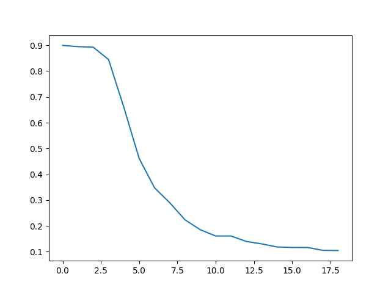

# NNUE-With Unbounded Minimax Searches (UBFMS)
Unbounded Minimax , Alpha-Beta and Monte-Carlo Tree Search & UBFMS applied on NNUE (Stockfish Neural Net) 

Report update
Release

# TODO
- [x] Test Chess-python library for representation
- [x] Call NNUE library
- [x] Test NNUE evaluation
- [x] Implement UBFM-Safe-Minimax : https://www.lamsade.dauphine.fr/~cazenave/papers/MinimaxStrikesBack.pdf
- [x] Implement MCTS
- [x] UBFMS vs UBFMS quiescence search (in progress)
- [ ] Play UBFMS/NNUE vs AlphaBéta/NNUE
- [ ] C++ version
- [ ] Change Value NN structure
- [ ] Train Value NN with more games 
- [ ] Quiscence Search
- [ ] Optimize DRL model 
- [ ] Implement MCTS search
- [ ] Optimize DRL model 
- [ ] Compare performances on Stoskfish v13
- [ ] Try to implement this previous searches approachs in C++ (more optimization)
- [ ] Add Quiescience Search (AlphaBeta for test)

UBFMS v function with pai-key (fen,move) (C++ done)
<<<<<<< HEAD
=======

>>>>>>> d4268bb9e75bb8b4d441e1333307be15d86e7f48
# Training Value Neural Network 
## Loss function per epochs 
 , C++ (UBFMS)
